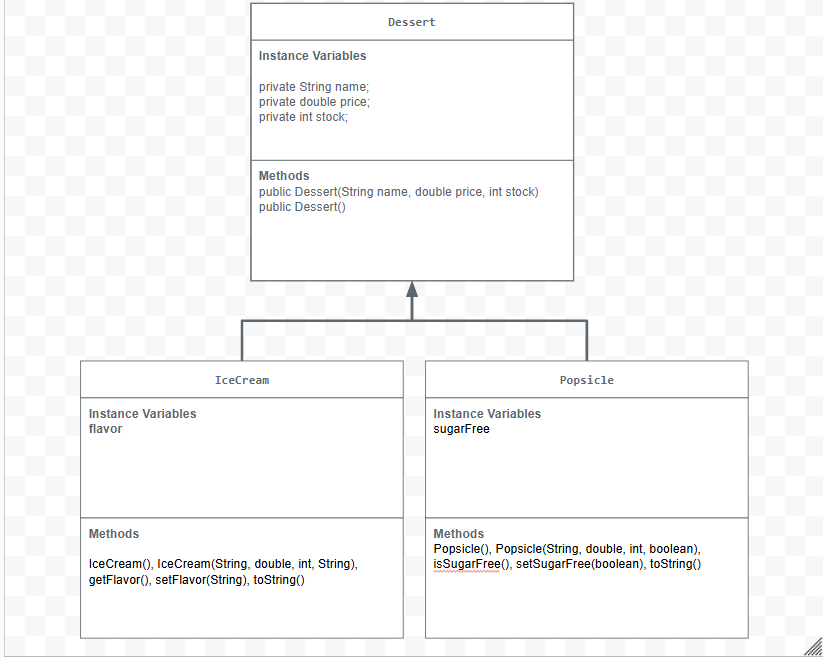

# AP-computer-science-a-unit-2-project
unit 2 project for ap computer science a
# Unit 2 - Store Management Project

## Introduction

You are opening a new business in your community! Businesses often need programs to manage the products and services they offer and track orders and requests from customers. Your goal is to create a store management system for your business.

## Requirements

Use your knowledge of object-oriented programming and class structure and design to create your store management system:
- **Create a class hierarchy** – Develop a superclass that represents a product or service your business offers and one or more subclasses that extend the superclass to represent more specific types of products or services.
- **Declare instance variables** – Declare instance variables in the superclass that are shared with the subclasses and instance variables in the subclasses that are not shared with the superclass.
- **Write constructors** – Write no-argument and parameterized constructors in the superclass and subclasses. Subclass constructors use the super keyword to call the superclass constructor.
- **Implement accessor and mutator methods** – Write accessor and mutator methods for instance variables that should be accessible and/or modifiable from outside of the class.
- **Implement a toString() method** – Write toString() methods in the superclass and subclasses that return information about the state of an object.

## UML Diagram

Put and image of your UML Diagram here. Upload the image of your UML Diagram to your repository, then use the Markdown syntax to insert your image here.

![UML Diagram for my project]

## Description

I created a Dessert Store with a Dessert superclass and three subclasses: IceCream, Popsicle, and ConeDessert. Each class has instance variables like name, price, and stock, plus subclass-specific ones like flavor or cone type or sugar free. I used constructors to set values, accessor methods to get values, and mutator methods to update them. The program prints each dessert’s info.
